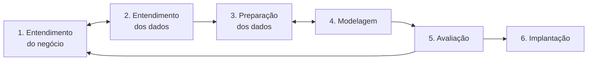

# CRISP-DM no projeto

## O que é

CRISP-DM (*Cross Industry Standard Process for Data Mining*) é o roteiro mais
usado em projetos de mineração de dados. Foi criado no fim dos anos 1990 por um
consórcio de empresas (DaimlerChrysler, SPSS, NCR e OHRA) e publicado como guia
em 2000. Divide o projeto em **6 fases**. Não é uma sequência rígida: é normal
voltar a uma fase anterior quando se descobre algo novo (as setas de volta no
diagrama).

A coleta, que às vezes aparece como fase separada, faz parte da fase 2 no
CRISP-DM original.

Termos técnicos dos dados: [guia.md](guia.md). Fontes: [fontes.md](fontes.md).

## Onde estamos

| Fase | Status | Arquivos |
|---|---|---|
| 1. Entendimento do negócio | feito (definição do alvo a confirmar) | este arquivo |
| 2. Entendimento dos dados | coleta e qualidade feitas; falta a exploração | `explorar.py`, `coleta.py`, `fontes.md` |
| 3. Preparação dos dados | integração feita; faltam inflação, atributos e alvo | `dataset.py` |
| 4. Modelagem | não iniciada | — |
| 5. Avaliação | não iniciada | — |
| 6. Implantação | não iniciada | apresentação |

## Os dados já bastam para começar?

**Sim.** O dataset tem 12 segmentos, 27 UFs e 198 séries mensais de jan/2012 a
jul–ago/2026 (32.955 linhas). Mesmo perdendo os primeiros meses no cálculo das
variações anuais e dos atributos com atraso, sobram mais de 20 mil exemplos para
treinar — suficiente para K-means e Random Forest.

Três cuidados antes de modelar (detalhados na fase 3):
1. **Inflação.** Os valores são nominais: tudo "cresce" com a inflação. Para
   saber se um setor foi bem de verdade, é preciso deflacionar pelo IPCA.
2. **Alvo.** "Bom faturamento" precisa virar uma regra calculável (proposta na
   fase 1).
3. **Divisão por tempo.** Treinar no passado e testar no futuro, nunca misturar.

A favor: como mostrado no [guia.md](guia.md#ancoragem-benchmarking), as
variações % do dataset são as mesmas dos índices oficiais. Um alvo baseado em
crescimento não depende da parte estimada (o nível em R$).

---

## Fase 1 — Entendimento do negócio

**O que a fase pede:** entender o problema do ponto de vista de quem vai usar o
resultado, traduzi-lo em um objetivo de mineração e definir como medir sucesso.

**Como estamos fazendo:**

- **Problema de negócio:** antecipar quais setores da economia, em quais estados,
  tendem a ter bom faturamento nos próximos meses — apoio a quem decide onde
  investir, abrir negócio, conceder crédito ou planejar estoque.
- **Situação encontrada:** o IBGE não publica faturamento mensal em reais. Há
  índices mensais de receita (comércio e serviços), produção física (indústria),
  valores anuais em R$ e, fora do IBGE, exportação mensal (agro). Por isso o
  dataset combina fontes (fase 3).
- **Objetivos de mineração** (a tradução técnica):
  1. **Agrupamento (não supervisionado):** encontrar grupos de séries
     segmento × UF com comportamento parecido — crescimento, volatilidade,
     sazonalidade, reação a crises.
  2. **Classificação (supervisionada):** para cada série e mês, prever se o
     faturamento dos **próximos 3 meses** vai crescer **acima da inflação** em
     relação aos mesmos 3 meses do ano anterior (classe 1) ou não (classe 0).
- **Definição proposta de "bom faturamento"** *(a confirmar com o professor)*:
  crescimento **real** positivo — descontado o IPCA — no trimestre seguinte,
  comparado ao mesmo trimestre do ano anterior. Alternativa: crescer acima da
  mediana de todas as séries no mesmo período (visão de ranking, que já
  neutraliza a inflação).
- **Por que 3 meses:** os índices saem com cerca de um mês e meio de atraso; 3
  meses ainda é útil para planejar e não é longe demais para prever.
- **Critério de sucesso:** o modelo tem de ser melhor que uma regra ingênua
  (*baseline*) — "se cresceu nos últimos 3 meses, vai crescer nos próximos 3" —
  no período de teste, medido por F1 e acurácia balanceada (fase 5).

**Status:** feito. Falta confirmar a definição do alvo.

---

## Fase 2 — Entendimento dos dados

**O que a fase pede:** coletar os dados iniciais, descrevê-los, explorá-los e
verificar a qualidade.

**Como estamos fazendo:**

1. **Coleta inicial** — feito.
   - Levantamento do catálogo do IBGE (PMC, PMS, PIM-PF, IPP, PAC, PAS, PIA e
     pesquisas do agro); `explorar.py` para ler os metadados de cada tabela.
   - Escolha da variável certa entre as várias de cada tabela: número-índice de
     receita nominal, sem ajuste sazonal ([guia.md](guia.md), seção 3).
   - Busca de fontes fora do IBGE para o agro: MAPA (VBP), Comex Stat e Banco
     Central.
   - `coleta.py` baixa as tabelas brutas; `dataset.py` baixa só o necessário.
     Tudo documentado em [fontes.md](fontes.md).
2. **Descrição** — feito. 12 segmentos, 198 séries, jan/2012 a ago/2026, valores
   em R$, cobertura de 11 a 27 UFs conforme o segmento (tabela no `CLAUDE.md`).
3. **Verificação de qualidade** — feito:
   - cobertura por UF e sigilo (`X`) testados em cada tabela antes de usar;
   - séries sem buracos (meses sem exportação agro preenchidos com 0);
   - soma de 2024 confere com a receita anual oficial, e a soma dos subsetores
     confere com o setor;
   - variação anual do dataset confere com a publicada pelo IBGE;
   - saltos grandes conferidos: batem com eventos reais (pandemia, enchente do
     RS).
4. **Exploração** — **a fazer.** Análises sugeridas (notebook com pandas +
   matplotlib):
   - gráfico de linha por segmento, somando as UFs nos segmentos com as 27 —
     tendência e sazonalidade;
   - boxplot da variação anual (%) por segmento — quais setores crescem mais e
     quais oscilam mais;
   - mapa de calor de correlação entre setores e entre UFs — quem anda junto;
   - queda em 2020 e velocidade de recuperação por setor;
   - peso de cada setor na economia de cada UF (ex.: agro no MT, indústria e
     serviços em SP).

**Status:** em andamento — falta a exploração.

---

## Fase 3 — Preparação dos dados

**O que a fase pede:** selecionar, limpar, construir atributos, integrar fontes e
formatar os dados do jeito que o modelo precisa. Costuma ser a fase mais longa.

### Já feito (`dataset.py`)

| Tarefa do CRISP-DM | O que foi feito |
|---|---|
| Integrar | 9 tabelas do IBGE, 1 consulta do Comex Stat e 1 série do BCB numa única tabela |
| Formatar | formato longo `nivel;segmento;uf;ano;mes;valor`, siglas de UF, CSV que abre no Excel |
| Construir | valor mensal em R$ por ancoragem (índice mensal × receita anual 2024); proxy da indústria (produção × preço); exportação de US$ para R$ |
| Limpar | descarte de símbolos especiais e de "UFs" não geográficas do Comex Stat; zeros nos meses sem exportação; só UFs com 2024 completo |
| Selecionar | segmentos sem dupla contagem (coluna `nivel`); fora atacado (sem dado por UF) e turismo (sobreposição) |

### A fazer (proposta)

1. **Deflacionar pelo IPCA.** Buscar o número-índice do IPCA (IBGE, tabela 1737,
   variável 2266, Brasil) e levar tudo para reais de uma mesma data:
   `valor_real = valor × IPCA_referência / IPCA_mês`. Assim "crescer" passa a
   significar crescer acima da inflação.
2. **Tirar a sazonalidade comparando com o mesmo mês do ano anterior.** Atributo
   principal: variação anual real, `valor_real(t) / valor_real(t−12) − 1`.
   Comparar abril com abril elimina o efeito do calendário sem ajuste sazonal.
3. **Construir atributos** para cada série e mês *t*, usando só dados até *t*:
   - variação anual real do mês e média dos últimos 3, 6 e 12 meses;
   - tendência recente: últimos 3 meses contra os 3 anteriores;
   - volatilidade: desvio-padrão da variação anual nos últimos 12 meses;
   - mês do ano;
   - segmento e UF como variáveis categóricas (*one-hot encoding*);
   - variação média do mesmo segmento nas outras UFs (o "clima" do setor no
     país);
   - opcional: câmbio (para o agro) e juros (Selic, disponível no SGS do BCB).
4. **Construir o alvo:** `alvo = 1` se a soma real dos meses t+1 a t+3 for maior
   que a dos mesmos meses do ano anterior; senão `0`.
5. **Evitar vazamento de dados (*data leakage*):** nenhum atributo pode usar
   informação posterior a *t* — médias móveis só com meses passados, e o alvo
   nunca entra como atributo.
6. **Tratar a pandemia:** testar duas versões — manter 2020–2021 com um atributo
   indicador (`pandemia = 1`) ou retirar esse período do treino. Em 2021 a
   comparação anual é contra a base fraca de 2020, o que infla o crescimento.
7. **Séries curtas:** MA, MS e RN na indústria só começam em 2022; avaliar se
   entram no treino.
8. **Escolher o nível:** começar com `nivel == "setor"` (110 séries, sem
   sobreposição); subsetores numa segunda rodada.
9. **Dividir por tempo, nunca aleatoriamente:** treino até 2022, validação em
   2023, teste de 2024 em diante. Embaralhar deixaria o modelo "ver o futuro" e
   daria um resultado otimista falso.
10. **Tabela para o K-means:** uma linha por série, resumindo o histórico —
    crescimento real médio anual, volatilidade, amplitude da sazonalidade, queda
    em 2020, correlação com o mesmo segmento no Brasil — **padronizada**
    (*z-score*), porque o K-means usa distância e escalas diferentes distorcem
    os grupos.

Ferramentas: adicionar `scikit-learn` e `matplotlib` ao `requirements.txt`.

**Status:** em andamento — integração feita, faltam os passos acima.

---

## Fase 4 — Modelagem

**O que a fase pede:** escolher as técnicas, planejar o teste, construir e
ajustar os modelos.

### Modelo 1 — K-means (agrupamento)

- **O que faz:** divide as séries em *k* grupos, colocando cada série no grupo
  cujo centro (centroide) está mais perto. Não precisa de alvo.
- **Pergunta que responde:** que perfis de faturamento existem? Hipóteses a
  verificar (não são resultados): um grupo de crescimento alto e volátil (agro
  exportador), um estável (serviços), um sensível a crises (veículos).
- **Como escolher k:** método do cotovelo (inércia × k) e coeficiente de
  silhueta, testando k de 2 a 8.
- **Uso:** descrever o cenário e, opcionalmente, virar atributo do Random Forest
  (o grupo da série).

### Modelo 2 — Random Forest (classificação)

- **O que faz:** treina centenas de árvores de decisão, cada uma com uma amostra
  diferente dos dados e dos atributos, e decide por votação. Lida bem com
  relações não lineares e atributos de tipos diferentes, e informa a
  **importância de cada atributo**.
- **Pergunta que responde:** esta série (segmento × UF) vai crescer acima da
  inflação nos próximos 3 meses?
- **Hiperparâmetros:** número de árvores (`n_estimators`), profundidade máxima
  (`max_depth`) e mínimo de exemplos por folha (`min_samples_leaf`), testados
  com **validação temporal** (`TimeSeriesSplit` do scikit-learn), nunca com
  validação cruzada aleatória.
- **Desbalanceamento:** se uma classe for bem mais comum (ex.: 70% dos casos
  crescem), usar `class_weight="balanced"` e olhar F1, não só acurácia.

### Baselines (comparação obrigatória)

1. **Persistência:** os próximos 3 meses repetem o sinal dos últimos 3 (cresceu
   → cresce).
2. **Classe majoritária:** prevê sempre a classe mais comum.

Se o Random Forest não superar a persistência, o modelo não agrega valor — e
isso também é um resultado válido para apresentar.

### Alternativas, se sobrar tempo

- **Regressão** (Random Forest Regressor ou regressão linear) prevendo o
  crescimento em %, em vez de sim/não.
- **Modelos clássicos de séries temporais** (SARIMA) em algumas séries, para
  comparação.

**Status:** não iniciada.

---

## Fase 5 — Avaliação

**O que a fase pede:** verificar se o modelo atinge o objetivo **de negócio**
(não só se tem boa métrica), revisar o processo e decidir os próximos passos.

### Avaliação técnica (período de teste, 2024 em diante)

| Métrica | O que mostra |
|---|---|
| Matriz de confusão | acertos e erros de cada tipo |
| Precisão | dos casos em que o modelo disse "vai crescer", quantos cresceram |
| Recall (sensibilidade) | dos casos que cresceram, quantos o modelo pegou |
| F1 | equilíbrio entre precisão e recall |
| Acurácia balanceada | acurácia que não se engana com classes desbalanceadas |

Para o K-means: silhueta, estabilidade dos grupos (rodar com sementes
diferentes) e se os grupos fazem sentido econômico.

### Avaliação de negócio

- O modelo supera o baseline de persistência? Por quanto?
- Onde erra: em quais segmentos e UFs? (Espera-se mais erro em agro e extrativa,
  que são voláteis.)
- Os atributos mais importantes fazem sentido econômico?
- Alguém tomaria uma decisão melhor com esse resultado do que sem ele?

### Revisão do processo

- Retomar as limitações do dataset (nível em R$ estimado, proxy da indústria,
  agro só exportação) e dizer como afetam as conclusões.
- Decidir: seguir para a implantação, voltar à fase 3 (novos atributos) ou à
  fase 1 (redefinir o alvo).

**Status:** não iniciada.

---

## Fase 6 — Implantação

**O que a fase pede:** colocar o resultado em uso, planejar a manutenção e fazer
o relatório final.

**Como vai ser neste projeto:**

- **Entregável:** apresentação na matéria, com:
  - problema e objetivo (fase 1);
  - fontes e montagem do dataset ([fontes.md](fontes.md), [guia.md](guia.md));
  - principais achados da exploração (fase 2);
  - grupos do K-means e o que caracteriza cada um;
  - desempenho do Random Forest contra o baseline;
  - **ranking final:** segmentos × UFs com maior probabilidade de crescimento
    real nos próximos 3 meses, a partir do último mês disponível;
  - limitações.
- **Reprodutibilidade:** `python dataset.py` baixa tudo de novo, já com os meses
  mais recentes; o pipeline de modelagem deve seguir o mesmo princípio.
- **Manutenção (conceitual):** em uso real, o modelo seria re-treinado todo mês
  com os dados novos e o desempenho acompanhado — mudanças na economia fazem o
  modelo perder precisão com o tempo.

**Status:** não iniciada.

---

## Próximos passos, em ordem

1. Confirmar a definição de "bom faturamento" (fase 1).
2. Notebook de exploração (fase 2).
3. Deflacionar pelo IPCA, criar atributos e alvo (fase 3).
4. K-means e Random Forest, com baseline (fase 4).
5. Avaliar no período de teste (fase 5).
6. Montar a apresentação (fase 6).
