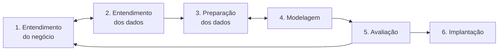

# CRISP-DM no projeto

## O que é

CRISP-DM (*Cross Industry Standard Process for Data Mining*) é o roteiro mais
usado em projetos de mineração de dados. Foi criado no fim dos anos 1990 por um
consórcio de empresas (DaimlerChrysler, SPSS, NCR e OHRA) e publicado em 2000.
Divide o trabalho em **6 fases**. Não é uma sequência rígida: é normal voltar a
uma fase anterior quando se descobre algo novo.

Termos técnicos: [guia.md](guia.md). Fontes: [fontes.md](fontes.md).

## Onde estamos

| Fase | Status | Arquivos |
|---|---|---|
| 1. Entendimento do negócio | feito (definição do alvo a confirmar) | este arquivo |
| 2. Entendimento dos dados | coleta e conferência feitas; falta a exploração | `dataset.py`, `explorar.py`, `fontes.md` |
| 3. Preparação dos dados | dados integrados; faltam atributos e alvo | `dataset.py` |
| 4. Modelagem | não iniciada | — |
| 5. Avaliação | não iniciada | — |
| 6. Implantação | não iniciada | apresentação |

## Os dados bastam para começar?

**Sim.** São 9.772 linhas: 2 setores (varejo e serviços) × 27 estados + Brasil,
mês a mês desde janeiro/2012. Descontando os meses iniciais usados para calcular
variações, sobram cerca de 8 mil exemplos (54 séries de estados × ~150 meses) —
suficiente para K-means e Random Forest.

---

## Fase 1 — Entendimento do negócio

**O que a fase pede:** entender o problema de quem vai usar o resultado,
transformar isso num objetivo de mineração e definir como medir sucesso.

**Como estamos fazendo:**

- **Problema:** antecipar em quais estados o comércio varejista e os serviços
  tendem a faturar bem nos próximos meses — útil para quem decide onde abrir um
  negócio, investir, conceder crédito ou planejar estoque.
- **Dados disponíveis:** o IBGE publica todo mês um índice de faturamento do
  varejo e dos serviços para cada estado.
- **Objetivos de mineração:**
  1. **Agrupamento:** encontrar grupos de estados/setores com comportamento
     parecido (crescimento, oscilação, reação a crises).
  2. **Classificação:** para cada estado, setor e mês, prever se o faturamento
     dos **próximos 3 meses** vai crescer **acima da inflação** em relação aos
     mesmos meses do ano anterior (sim = 1, não = 0).
- **Por que 3 meses:** o IBGE divulga os dados com cerca de um mês e meio de
  atraso; 3 meses é útil para planejar e não é longe demais para prever.
- **Critério de sucesso:** o modelo tem de acertar mais que uma regra simples —
  "se cresceu nos últimos 3 meses, vai crescer nos próximos 3".

**Status:** feito. Confirmar com o professor a definição de "bom faturamento"
(proposta: crescimento acima da inflação).

---

## Fase 2 — Entendimento dos dados

**O que a fase pede:** coletar os dados, descrever o que há neles, explorar e
verificar a qualidade.

**Como estamos fazendo:**

1. **Coleta** — feito. Levantamento das pesquisas do IBGE e de outras fontes
   (Kaggle, CONFAZ, agro, indústria); escolha das duas pesquisas com
   faturamento mensal para todos os estados (PMC e PMS) mais o IPCA. O
   `dataset.py` baixa tudo da API do IBGE.
2. **Descrição** — feito. 2 setores, 27 estados + Brasil, varejo de jan/2012 a
   jun/2026 e serviços de jan/2012 a jul/2026, índice de faturamento
   (2022 = 100) e IPCA.
3. **Qualidade** — feito. Sem meses faltando, todos os estados presentes, IPCA
   em todos os meses; valores conferidos com o site do IBGE (ex.: varejo SP
   abr/2025 = 118,5, variação anual de +13,8% igual à publicada).
4. **Exploração** — **a fazer.** Análises sugeridas (notebook com pandas e
   matplotlib):
   - gráfico de linha do Brasil nos dois setores — tendência, Natal, pandemia;
   - crescimento real anual por estado — ranking de quem mais cresce;
   - boxplot da variação anual por estado — quem oscila mais;
   - comparação varejo × serviços: os estados andam juntos nos dois setores?
   - queda em 2020 e tempo de recuperação por estado.

**Status:** em andamento — falta a exploração.

---

## Fase 3 — Preparação dos dados

**O que a fase pede:** limpar, integrar, criar atributos e deixar os dados no
formato que o modelo precisa.

### Já feito (`dataset.py`)

| Tarefa | O que foi feito |
|---|---|
| Selecionar | só o índice de receita nominal sem ajuste sazonal; 2 setores; 27 estados + Brasil |
| Integrar | 3 tabelas do IBGE (varejo, serviços e IPCA) numa única tabela |
| Limpar | símbolos do IBGE que não são números (`X`, `..`) descartados |
| Formatar | uma linha por setor × estado × mês, com siglas de UF |

### A fazer

1. **Descontar a inflação:** `indice_real = indice_receita / ipca`.
2. **Variação anual real:** comparar cada mês com o mesmo mês do ano anterior
   (`indice_real` do mês ÷ `indice_real` de 12 meses antes − 1). Isso elimina o
   efeito do Natal e de outras datas.
3. **Atributos** para cada estado, setor e mês, usando só o passado:
   - variação anual real do mês e média dos últimos 3, 6 e 12 meses;
   - oscilação: desvio-padrão da variação nos últimos 12 meses;
   - variação do mesmo setor no Brasil (linhas `BR`) — o "clima" do país;
   - mês do ano, setor e estado.
4. **Alvo:** `1` se o faturamento real dos próximos 3 meses for maior que o dos
   mesmos 3 meses do ano anterior; senão `0`.
5. **Não deixar o futuro vazar:** nenhum atributo pode usar dados posteriores ao
   mês da previsão.
6. **Pandemia:** 2020 e 2021 são fora do padrão (queda forte e depois base de
   comparação fraca). Testar com e sem esse período no treino.
7. **Linhas `BR`:** ficam fora do treino (são a soma dos estados) e entram só
   como atributo.
8. **Divisão por tempo, nunca aleatória:** treino até 2022, validação em 2023,
   teste de 2024 em diante.
9. **Tabela para o K-means:** uma linha por estado × setor com o resumo do
   histórico (crescimento real médio, oscilação, queda em 2020), com as colunas
   padronizadas para ficarem na mesma escala.

Bibliotecas: adicionar `scikit-learn` e `matplotlib` ao `requirements.txt`.

**Status:** em andamento.

---

## Fase 4 — Modelagem

**O que a fase pede:** escolher as técnicas, construir e ajustar os modelos.

### K-means (agrupamento)

- **O que faz:** separa os estados/setores em *k* grupos, juntando os que têm
  comportamento parecido. Não precisa de alvo.
- **Pergunta:** que perfis de faturamento existem? (ex.: estados que crescem
  muito e oscilam muito × estados estáveis)
- **Escolha do k:** método do cotovelo e coeficiente de silhueta, testando de 2
  a 8 grupos.

### Random Forest (classificação)

- **O que faz:** cria centenas de árvores de decisão, cada uma treinada com uma
  parte diferente dos dados, e decide por votação. Mostra também quais
  atributos mais pesam na previsão.
- **Pergunta:** este estado, neste setor, vai crescer acima da inflação nos
  próximos 3 meses?
- **Ajuste:** número de árvores e profundidade, testados com validação por
  tempo (`TimeSeriesSplit` do scikit-learn).

### Regra de comparação (baseline)

"Se cresceu nos últimos 3 meses, vai crescer nos próximos 3." Se o Random Forest
não acertar mais que essa regra, o modelo não agrega valor — e isso também é um
resultado válido para apresentar.

**Status:** não iniciada.

---

## Fase 5 — Avaliação

**O que a fase pede:** ver se o modelo resolve o problema de negócio, não só se
tem boa métrica.

**Como vamos avaliar (período de teste, 2024 em diante):**

| Métrica | O que mostra |
|---|---|
| Matriz de confusão | acertos e erros de cada tipo |
| Precisão | quando o modelo disse "vai crescer", quantas vezes cresceu |
| Recall | dos casos que cresceram, quantos o modelo acertou |
| F1 | equilíbrio entre precisão e recall |

Para o K-means: coeficiente de silhueta e se os grupos fazem sentido.

**Perguntas de negócio:**
- O modelo acerta mais que a regra de comparação?
- Em quais estados e setores ele erra mais?
- Os atributos mais importantes fazem sentido?

**Status:** não iniciada.

---

## Fase 6 — Implantação

**O que a fase pede:** entregar o resultado para uso.

**Neste projeto:** a apresentação na matéria, com:
- problema e objetivo;
- dados e fontes ([fontes.md](fontes.md));
- principais achados da exploração;
- grupos do K-means;
- desempenho do Random Forest contra a regra de comparação;
- **ranking final:** estados e setores com maior chance de crescimento real nos
  próximos 3 meses;
- limitações.

`python dataset.py` baixa os dados de novo com os meses mais recentes, então o
resultado pode ser atualizado a qualquer momento.

**Status:** não iniciada.

---

## Próximos passos, em ordem

1. Confirmar a definição de "bom faturamento" (fase 1).
2. Notebook de exploração (fase 2).
3. Descontar a inflação, criar atributos e alvo (fase 3).
4. K-means e Random Forest, com a regra de comparação (fase 4).
5. Avaliar no período de teste (fase 5).
6. Montar a apresentação (fase 6).
